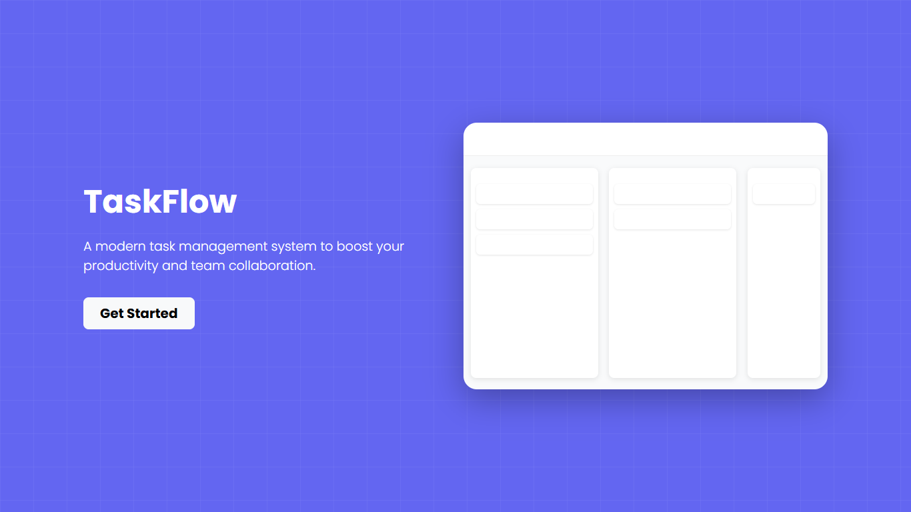
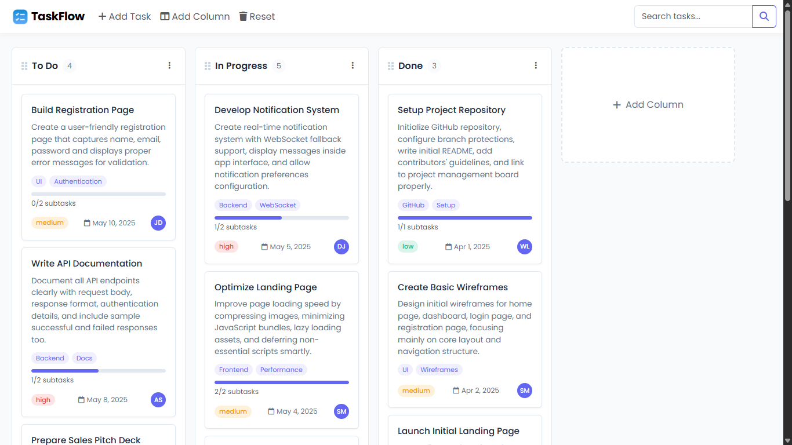

# TaskFlow - Modern Task Management System

[](https://kanbanboard.pages.dev/)

A modern, intuitive task management system designed to boost productivity and team collaboration. TaskFlow provides a flexible kanban-style interface for organizing tasks across customizable columns, perfect for individuals and teams looking to streamline their workflow.

## 🌟 Features

- **Intuitive Drag-and-Drop Interface**: Easily move tasks between different stages of completion
- **Customizable Columns**: Create and manage columns to match your workflow
- **Comprehensive Task Details**: Include descriptions, due dates, priorities, assignees, and more
- **Task Organization Options**:
  - Priority levels (Low, Medium, High)
  - Due dates
  - Task assignment
  - Custom tags
  - Attachments with URLs
  - Subtasks/Checklists
  - Comments
- **Search Functionality**: Quickly find tasks using the search bar
- **Responsive Design**: Works seamlessly on desktop and mobile devices
- **Local Storage**: All data is saved in your browser's local storage for persistence

---

## 📸 Screenshots

*Initial screen view upon accessing TaskFlow.*


*The main board view with multiple columns and tasks*


*Detailed task information modal*

---

## 💻 Technologies Used

- HTML5
- CSS3
- JavaScript (Vanilla)
- Bootstrap 5.3.0
- Font Awesome 6.4.0
- Google Fonts (Poppins)
- SweetAlert2 for notifications

## 🚀 Getting Started

### Online Demo

Visit [TaskFlow Demo](https://kanbanboard.pages.dev/) to see the application in action.

### Local Installation

1. Clone the repository:
   ```bash
   git clone https://github.com/ThisIs-Developer/TaskFlow.git
   ```

2. Navigate to the project directory:
   ```bash
   cd taskflow
   ```

3. Open `index.html` in your browser to start using TaskFlow.

## 📱 Usage Guide

1. **Getting Started**: Click the "Get Started" button on the welcome screen to access the main application.

2. **Creating Columns**: 
   - Click the "Add Column" button in the navigation bar
   - Enter a title for your column (e.g., "To Do", "In Progress", "Done")
   - Click "Save Column"

3. **Adding Tasks**:
   - Click the "Add Task" button in the navigation bar or the floating "+" button on mobile
   - Fill in the task details:
     - Title (required)
     - Description
     - Priority level
     - Due date
     - Assignee
     - Tags (comma-separated)
     - Attachments (with optional URLs)
     - Subtasks/Checklist items
     - Comments
   - Click "Save Task"

4. **Managing Tasks**:
   - Click on any task card to view or edit its details
   - Drag and drop tasks between columns to update their status
   - Use the search bar to find specific tasks

5. **Resetting Data**: Click the "Reset" button to clear all data and start fresh (with confirmation)

## 🏗️ Project Structure

- `index.html`: Main HTML structure and UI elements
- `styles.css`: Custom styling and responsive design rules
- `scripts.js`: JavaScript functionality for task and column management
- `assets/`: Contains images and icons

## 🔒 Data Privacy

All data is stored locally in your browser using localStorage. No data is sent to any external servers.

## 🔧 Customization

TaskFlow can be customized by modifying the CSS variables in the `styles.css` file to match your brand colors and preferences.

## 🤝 Contributing

Contributions are welcome! Please feel free to submit a Pull Request.

1. Fork the repository
2. Create your feature branch (`git checkout -b feature/amazing-feature`)
3. Commit your changes (`git commit -m 'Add some amazing feature'`)
4. Push to the branch (`git push origin feature/amazing-feature`)
5. Open a Pull Request

## 📄 License

This project is licensed under the MIT License - see the [LICENSE](LICENSE) file for details.

---

[](https://github.com/ThisIs-Developer/TaskFlow)
[](https://github.com/ThisIs-Developer/TaskFlow)
[](https://github.com/ThisIs-Developer/TaskFlow/issues)
